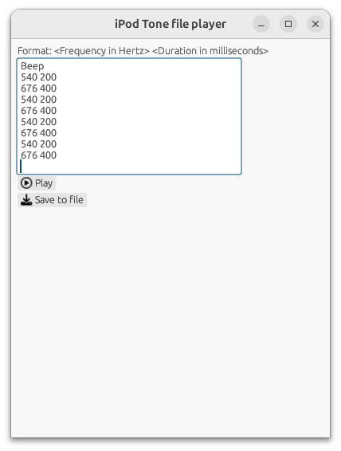

# Background

Starting with the 3rd generation (?), iPods came equipped with the ability to design custom alarms. These are specified through ".tone" files.

A tone file is a text file, with the first line consisting of the header (usually just the tone name), followed by several lines of text, each line having 2 integers, separated by a space.

The first integer represents a frequency (in Hertz) and the second integer represents the duration (in milliseconds).

Here's an example of a tone file:

```
Beep
540 200
676 400
540 200
676 400
540 200
676 400
540 200
676 400
```

In this example alarm tone, a 540 Hz sound will be emitted for 200 milliseconds, followed immediately by a 676 Hz sound by 400 milliseconds, and so on, until the end of the file is reached.

The sounds are emitted by the iPod's [piezoelectric speaker](https://en.wikipedia.org/wiki/Piezoelectric_speaker). The specific frequency range is unknown.

# Code

This directory contains some utilities for working with tone files. There is a Rust CLI utility, a Rust GUI, and a simple shell script.

## GUI

Run the `ipod_tone_player_gui` binary.

You can edit tone files in real time, then either play them directly to your headphones/speakers, or save it to a WAV file.




## CLI

The CLI binary is called `ipod_tone_player_cli`. It lets you basically do the same thing the GUI does.

(1) play the sounds encoded in a Tone file to your actual speakers/headphones
(2) save the sounds encoded in a Tone file, to a WAV file

To play the sounds from your speakers/headphones, do:

```bash
./ipod_tone_player <TONE_FILE_PATH> --sound
```

To save the sounds to a WAV file, do:

```bash
./ipod_tone_player <TONE_FILE_PATH> --file
```

## Shell script

The script `mobo_tone_player.sh` can be used to play tone files on your computer directly, using your motherboard's own piezo speaker (not your actual speakers/headphones!):

Simply run:

```bash
./mobo_tone_player.sh <PATH_TO_TONE_FILE>
```

and you should hear the tone file being played.


# :musical_score: :musical_score:

Links to some fun tones to try out:

* [https://github.com/weeowey/CustomiPodAlarmTones](https://github.com/weeowey/CustomiPodAlarmTones)

* [https://www.reddit.com/r/ipod/comments/14mcsvw/i_made_another_ipod_alarm_tone_boney_m_rasputin/](https://www.reddit.com/r/ipod/comments/14mcsvw/i_made_another_ipod_alarm_tone_boney_m_rasputin/)